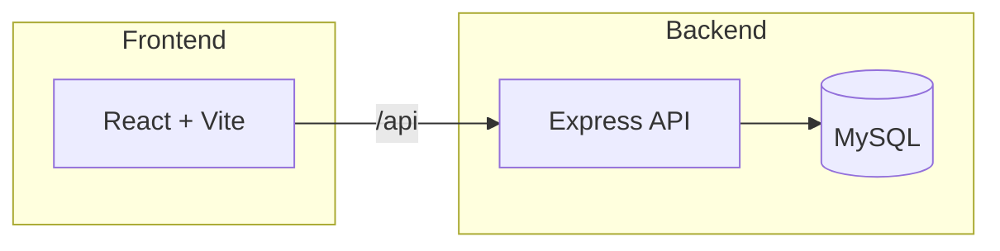

# GitHub Profile Analyzer API

## 📖 Overview
A **production‑ready** Node.js + Express backend that analyzes any public GitHub user profile, computes deep repository statistics, and stores the results in a MySQL database. The service is built with clean architecture principles, a thin dependency surface, and zero reliance on heavyweight ORMs, making it an ideal learning project for junior developers.

---

## 🚀 Key Features
- **GitHub API Integration** – fetches profile metadata and full repository list with Axios.
- **Automatic DB Provisioning** – creates the `github_analyzer` database and `github_profiles` table (including a JSON `repositories` column) on first run.
- **Repository Analytics Engine** – aggregates total stars, forks, top languages, most‑starred/forked repos, and unique topics.
- **Upsert Logic** – `INSERT … ON DUPLICATE KEY UPDATE` ensures a profile is stored idempotently.
- **Robust Validation** – `express-validator` guarantees well‑formed usernames and sanitises inputs.
- **Security Hardened** – `helmet`, `cors`, and environment‑based secret handling.
- **Health Endpoint** – simple `/health` check exposing uptime and DB connectivity.
- **Full‑Text JSON Column** – stores the complete repository array in MySQL for later analysis.

---

## 🛠️ Tech Stack
- **Runtime:** Node.js 18+
- **Framework:** Express 4
- **Database:** MySQL 8 (using `mysql2/promise` connection pool)
- **HTTP Client:** Axios
- **Validation:** express-validator
- **Security:** helmet, cors
- **Environment Management:** dotenv
- **Development:** nodemon, concurrently (for running backend & frontend together)

---

## 📋 Prerequisites
- **Node.js** ≥ 18
- **MySQL** ≥ 8 (local or remote instance)
- (Optional) **GitHub Personal Access Token** – raises API rate limits from 60→5 000 requests per hour.

---

## ⚙️ Setup Instructions
1. **Clone the repository** (if you haven't already) and navigate to the backend folder:
   ```bash
   cd github-profile-analyzer/backend
   ```
2. **Create environment file**:
   ```bash
   cp .env.example .env
   ```
   Edit `.env` and fill in your credentials:
   ```env
   PORT=3000
   DB_HOST=localhost
   DB_USER=root
   DB_PASSWORD=your_mysql_password
   GITHUB_TOKEN=your_github_pat   # optional
   ```
3. **Install dependencies**:
   ```bash
   npm install
   ```
4. **Run the server** (development mode with hot‑reloading):
   ```bash
   npm run dev
   ```
   The server will automatically:
   - Connect to MySQL.
   - Create the `github_analyzer` database if missing.
   - Create the `github_profiles` table with the `repositories` JSON column.
   - Start listening on the port defined in `.env`.

---

## 🌐 API Reference
### Health Check
```
GET /health
```
Returns service status, timestamp, and uptime.

### Analyze Profile
```
POST /api/profiles/analyze
Content-Type: application/json
Body: { "username": "octocat" }
```
Fetches data from GitHub, computes analytics, upserts the record, and returns the full stored profile (including a `repositories` array).

### List Profiles
```
GET /api/profiles?sort=followers&limit=10&search=tor
```
Supports sorting (`followers`, `public_repos`, `total_stars`, `analyzed_at`), limiting, and case‑insensitive username search.

### Get Single Profile
```
GET /api/profiles/:username
``` 
Returns the stored profile for the given username.

### Delete Profile
```
DELETE /api/profiles/:username
``` 
Removes a profile from the database.

---

## 🧪 Testing
The project includes a basic Jest test suite for the service layer.
```bash
npm run test
```
Feel free to extend tests for controllers, middleware, and DB helpers.

---

## 🤝 Contributing
1. Fork the repo and create a feature branch.
2. Follow the existing code style (ESLint + Prettier).
3. Write tests for new functionality.
4. Submit a Pull Request with a clear description of the change.

---

## 📜 License
MIT © 2026 Your Name

---

## 📐 Architecture Diagram
> *(Add an architecture diagram image `docs/architecture.png` to the repo and reference it here.)*



---

*This README is designed to be clear, visually appealing, and helpful for developers of all levels joining the project.*

A robust, production-quality Node.js and Express backend service designed to analyze GitHub user profiles, compute repository statistics, and store deep profile insights inside a MySQL database using raw SQL queries.

This backend serves as a clean, modular example of standard Node.js development practices without the reliance on bulky ORMs (like Sequelize or Prisma), featuring automatic database schema provisioning, robust security, strict payload validation, and defensive API integration logic.

---

## 🚀 Key Features

*   **GitHub API Integration:** Leverages Axios to gather profile metadata and repository information.
*   **Automatic Database & Table Provisioning:** Initializes and connects without manual MySQL schema script execution.
*   **Repository Analytics Engine:** Computes statistics on the fly, including:
    *   Total stars and forks across all public repositories.
    *   Top 5 most-used programming languages.
    *   Identifying the most-starred and most-forked repositories.
    *   Aggregating unique repository topics (up to a limit of 15).
*   **Upsert Operations:** Employs `INSERT ... ON DUPLICATE KEY UPDATE` to merge incoming data updates, keeping records up to date.
*   **Secure API Endpoint Query Filters:** Includes filtering, case-insensitive searches, whitelisted sorting parameters, and strict payload validation (via `express-validator`).
*   **Comprehensive Health Monitoring:** Exposes uptime metric conversions and database connectivity state.

---

## 🛠️ Tech Stack

*   **Runtime:** Node.js (v18+)
*   **Framework:** Express.js (v4)
*   **Database Client:** `mysql2` (Using connection pools and Promise wrappers)
*   **HTTP Client:** `axios`
*   **Validation:** `express-validator`
*   **Security:** `helmet` and `cors`
*   **Environment Manager:** `dotenv`
*   **Development Tools:** `nodemon`

---

## 📋 Prerequisites

*   **Node.js:** Version 18.0.0 or higher
*   **MySQL Server:** Version 8.0 or higher
*   **(Optional) GitHub Personal Access Token:** To increase rate limit constraints (from 60 requests/hour to 5,000 requests/hour).

---

## ⚙️ Setup Instructions

### 1. Configure the Environment
Copy the configuration template to create your `.env` file:
```bash
cp .env.example .env
```
Open `.env` and fill in your database details and GitHub personal access token (if available):
```env
PORT=3000
DB_HOST=localhost
DB_USER=root
DB_PASSWORD=your_mysql_password
GITHUB_TOKEN=your_github_personal_access_token
```

### 2. Install Dependencies
Install all required Node modules:
```bash
npm install
```

### 3. Start the Server
Run the project in development mode (with hot-reloading active):
```bash
npm run dev
```
On startup, the server automatically connects to MySQL, executes database/table creation scripts if they do not exist, and runs the application.

---

## 🌐 API Endpoint Reference

### 1. GET /health
Retrieves the service health status, current timestamp, and server uptime.

*   **URL:** `/health`
*   **Method:** `GET`
*   **Example Curl:**
    ```bash
    curl -X GET http://localhost:3000/health
    ```
*   **Response (200 OK):**
    ```json
    {
      "success": true,
      "status": "OK",
      "service": "GitHub Profile Analyzer API",
      "timestamp": "2026-06-15T11:42:00.000Z",
      "uptime": "0h 15m 30s"
    }
    ```

### 2. POST /api/profiles/analyze
Fetches GitHub information for a user, runs analytical calculations, upserts the record to MySQL, and returns the stored data.

*   **URL:** `/api/profiles/analyze`
*   **Method:** `POST`
*   **Headers:** `Content-Type: application/json`
*   **Request Body:**
    ```json
    {
      "username": "torvalds"
    }
    ```
*   **Validation Rules:** GitHub username must be 1 to 39 characters, containing only alphanumeric characters and single, non-consecutive hyphens.
*   **Example Curl:**
    ```bash
    curl -X POST http://localhost:3000/api/profiles/analyze \
      -H "Content-Type: application/json" \
      -d '{"username": "torvalds"}'
    ```
*   **Response (201 Created for New / 200 OK for Update):**
    ```json
    {
      "success": true,
      "message": "Profile analyzed and saved successfully",
      "isNew": true,
      "data": {
        "id": 1,
        "username": "torvalds",
        "name": "Linus Torvalds",
        "bio": "Creator of Linux and Git",
        "avatar_url": "https://avatars.githubusercontent.com/u/1024?v=4",
        "location": "Portland, OR",
        "company": "Linux Foundation",
        "blog": "https://linuxfoundation.org",
        "email": null,
        "twitter_username": null,
        "public_repos": 6,
        "public_gists": 0,
        "followers": 204900,
        "following": 0,
        "total_stars": 340,
        "total_forks": 120,
        "top_languages": {
          "C": 4,
          "Shell": 2
        },
        "most_starred_repo": "subsurface (⭐ 280)",
        "most_forked_repo": "subsurface (🍴 90)",
        "repo_topics": ["linux", "git", "subsurface"],
        "account_created_at": "2008-01-14 04:33:35",
        "github_updated_at": "2026-06-12 12:45:00",
        "analyzed_at": "2026-06-15 11:42:30"
      }
    }
    ```

### 3. GET /api/profiles
Retrieves all analyzed user profiles. Supports sorting, limits, and searching.

*   **URL:** `/api/profiles`
*   **Method:** `GET`
*   **Query Parameters:**
    *   `sort`: Sort results by `followers`, `public_repos`, `total_stars`, or `analyzed_at` (default: `analyzed_at` DESC).
    *   `limit`: Restrict quantity of profiles returned (default: `50`, maximum: `100`).
    *   `search`: Case-insensitive text filter applied to username columns.
*   **Example Curl:**
    ```bash
    curl -X GET "http://localhost:3000/api/profiles?sort=followers&limit=5&search=tor"
    ```
*   **Response (200 OK):**
    ```json
    {
      "success": true,
      "count": 1,
      "data": [
        {
          "id": 1,
          "username": "torvalds",
          "name": "Linus Torvalds",
          "bio": "Creator of Linux and Git",
          "avatar_url": "https://avatars.githubusercontent.com/u/1024?v=4",
          "location": "Portland, OR",
          "company": "Linux Foundation",
          "blog": "https://linuxfoundation.org",
          "email": null,
          "twitter_username": null,
          "public_repos": 6,
          "public_gists": 0,
          "followers": 204900,
          "following": 0,
          "total_stars": 340,
          "total_forks": 120,
          "top_languages": {
            "C": 4,
            "Shell": 2
          },
          "most_starred_repo": "subsurface (⭐ 280)",
          "most_forked_repo": "subsurface (🍴 90)",
          "repo_topics": ["linux", "git", "subsurface"],
          "account_created_at": "2008-01-14 04:33:35",
          "github_updated_at": "2026-06-12 12:45:00",
          "analyzed_at": "2026-06-15 11:42:30"
        }
      ]
    }
    ```

### 4. GET /api/profiles/:username
Retrieves the details of a single user profile stored locally in the database.

*   **URL:** `/api/profiles/:username`
*   **Method:** `GET`
*   **Example Curl:**
    ```bash
    curl -X GET http://localhost:3000/api/profiles/torvalds
    ```
*   **Response (200 OK):**
    ```json
    {
      "success": true,
      "data": {
        "id": 1,
        "username": "torvalds",
        "name": "Linus Torvalds",
        "bio": "Creator of Linux and Git",
        "avatar_url": "https://avatars.githubusercontent.com/u/1024?v=4",
        "location": "Portland, OR",
        "company": "Linux Foundation",
        "blog": "https://linuxfoundation.org",
        "email": null,
        "twitter_username": null,
        "public_repos": 6,
        "public_gists": 0,
        "followers": 204900,
        "following": 0,
        "total_stars": 340,
        "total_forks": 120,
        "top_languages": {
          "C": 4,
          "Shell": 2
        },
        "most_starred_repo": "subsurface (⭐ 280)",
        "most_forked_repo": "subsurface (🍴 90)",
        "repo_topics": ["linux", "git", "subsurface"],
        "account_created_at": "2008-01-14 04:33:35",
        "github_updated_at": "2026-06-12 12:45:00",
        "analyzed_at": "2026-06-15 11:42:30"
      }
    }
    ```
*   **Error Response (404 Not Found):**
    ```json
    {
      "success": false,
      "message": "Profile not found. Analyze it first using POST /api/profiles/analyze"
    }
    ```

### 5. DELETE /api/profiles/:username
Deletes a user's record from the local database.

*   **URL:** `/api/profiles/:username`
*   **Method:** `DELETE`
*   **Example Curl:**
    ```bash
    curl -X DELETE http://localhost:3000/api/profiles/torvalds
    ```
*   **Response (200 OK):**
    ```json
    {
      "success": true,
      "message": "Profile 'torvalds' deleted successfully"
    }
    ```
*   **Error Response (404 Not Found):**
    ```json
    {
      "success": false,
      "message": "Profile 'torvalds' not found"
    }
    ```

---

## 🌟 What Makes This Project Stand Out

1.  **Zero Manual DB Operations:** Uses a temporary connection mechanism on start to check and create databases and table structures dynamically.
2.  **SQL Injection Prevention:** Avoids dynamic SQL string interpolation by whitelisting sort properties and binding limits and parameters securely.
3.  **Defensive API Fallback Handling:** Detects placeholder values (e.g. `'your_github_personal_access_token_here'`) in `.env` to prevent authorization errors due to unconfigured properties.
4.  **Secure & Custom Logger:** Standard console output formatting tracks exact API resource execution time in milliseconds without bulky logger packages.
5.  **Robust Error Mapping:** Standardizes API status responses for rate-limit constraints (403), resource misses (404), and validation faults (400).
6.  **Fail-safe JSON Column Processing:** Parses database values safely, accommodating runtime environment differences where query adapters might return database types as string expressions instead of JSON arrays/objects.
